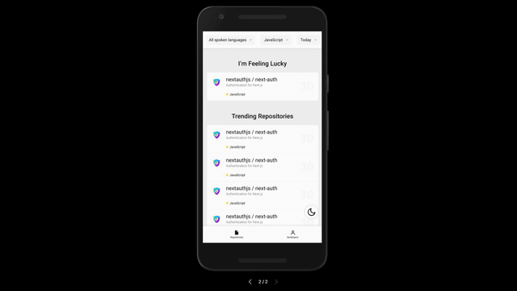

  

<h1 align="center">Android Hacker Tab</h1>

---

 An android version of a chrome browser extension: https://github.com/huchenme/hacker-tab-extension
      

## 📝 Table of Contents

- [About](#about)
- [Getting Started](#getting_started)
- [Running the tests](#tests)
- [Usage](#usage)
- [Deployment](#deployment)
- [Built Using](#built_using)
- [TODO](../TODO.md)
- [Authors](#authors)
- [Acknowledgments](#acknowledgement)

## 🧐 About 

Android Hacker Tab aims to bring the [browser extension hacker tab](https://github.com/huchenme/hacker-tab-extension) experience in a mobile app form.

## 🏁 Getting Started 

These instructions will get you a copy of the project up and running on your local machine for development and testing purposes. See [deployment](#deployment) for notes on how to deploy the project on a live system.

### Prerequisites

What things you need to get the app up and running.

- Android Studio
- Minimun SDK version 21
- Target SDK version 30

## 🔧 Running the tests 

All the test will be located at `/app/src/test`, if you would like to create or run the test, you may refer to [https://developer.android.com/studio/test](https://developer.android.com/studio/test) for more information

## 🎈 Usage 

As shown on the demo, all the trending repositories will be listed out!

There will be filter functions on the top bar, do feel free to adjust to your own preferences!

## 🚀 Deployment 

To publish this app, you will need to sign it and have a Google Play Developer account, for more information, you may refer to [https://developer.android.com/studio/publish/app-signing](https://developer.android.com/studio/publish/app-signing)

## ⛏️ Built Using 

- Kotlin
- Android Studio
- [https://github.com/pupubird/get-github-trending](https://github.com/pupubird/get-github-trending) for REST API

## ✍️ Authors 

- [@vrnsky](https://github.com/vrnsky)
- [@pupubird](https://github.com/pupubird)

## 🎉 Acknowledgements 

- Hat tip to anyone whose code was used
- Thanks [Hacker Tab Extension](https://github.com/huchenme/hacker-tab-extension) for the inspiration
